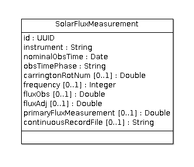

# Solar Flux Monitor

DRAO Solar Flux Monitor database info for use in the CADC `youcat` TAP service.

This abstract model includes an unique identifier that is not currently part of the
table defintion. Including this would help prevent duplicate records and could enable
the ability to query for and update specific records in future... TBD.

